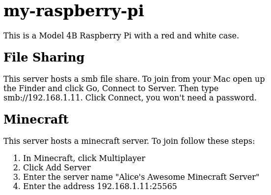

# Self-Documenting Micro-Servers

If you're anything like me, you have a number of small computers in your home (e.g. raspberry pi's) providing various services. After some time it's easy to forget which services are available on which servers, or even how to connect and make use of those services. Or perhaps you want to provide guides for your family or guests to be able to use these services.

The best solution I've found is to serve these documents from the servers themselves over HTTP. This has the benefits of making the documents easy to access for non-technical folk, and a making it easy to update the docs whenever you update the server.

To start let's install a web server on our micro-server.

```
> sudo apt install apache2
```

You should now be able to visit the IP address of your server to see the default Apache homepage.
If you've set the host name and your client supports mDNS ([Android does not](https://issuetracker.google.com/issues/36916949)) you can browse by host name,
such as `my-raspberry-pi.local`.

We're going to publish some docs about this server via the web server.
If you're planning to run a web server for some other purpose,
you can use [virtual hosts](https://httpd.apache.org/docs/2.4/vhosts/) to publish the docs at another port, like 8008 or 8080.

The default homepage is `/var/www/html/index.html`, you can edit this and replace it with your own content like

```
<h1>my-raspberry-pi</h1>
<p>
This is a Model 4B Raspberry Pi with a red and white case.
</p>
<h2>File Sharing</h2>
<p>
This server hosts a smb file share.
To join from your Mac open up the Finder and click Go, Connect to Server.
Then type smb://192.168.1.11. Click Connect, you won't need a password.
</p>
<h2>Minecraft</h2>
<p>
This server hosts a minecraft server.
To join follow these steps:
<ol>
  <li>In Minecraft, click Multiplayer</li>
  <li>Click Add Server</li>
  <li>Enter the server name "Alice's Awesome Minecraft Server"</li>
  <li>Enter the address 192.168.1.11:25565</li>
</ol>
</p>
```

Refreshing the web page should show you something like this. Basic, but functional and easy to set up.



As you add or remove services on the server, you can update the docs.

## Making it Smart

With a few changes we can have the page dynamically generated each time, and include real-time information.

Replace `/var/www/hmtl/index.html` with `index.cgi` and the following contents:
```
#! /bin/sh

cat << EOF
Content-type: text/html

<html>
<head>
<title>$(hostname)</title>
</head>
<body>

<h1>$(hostname)</h1>

<h2>File Sharing</h2>
<p>
This server hosts a smb file share.
To join from your Mac open up the Finder and click Go, Connect to Server.
Then type smb://192.168.1.11. Click Connect, you won't need a password.
</p>

</body>
</html>
EOF
```

Here we're using CGI to automatically fill in the host name. But if you refreshing the web page you'll just see the contents of the script, it hasn't run. We need to make a few more changes.

Add this block to the vhost in `/etc/apache2/sites-enabled/000-default.conf`
or a different vhost on a different port if you're planning to use that
one for something else.

```
<Directory "/var/www/html">
  AddHandler cgi-script .cgi
  Options +ExecCGI
</Directory>
```

Then make you script executable and enable the CGI module in Apache.

```
> sudo chmod +x /var/www/html/index.cgi
> sudo a2enmod cgi
> sudo service apache2 restart
```

Refreshing now should show you the rendered output of the script.

We can add more details to help us easily monitor the server's condition.

```
#! /bin/sh

cat << EOF
Content-type: text/html

<html>
<head>
<title>$(hostname)</title>
</head>
<body>

<h1>$(hostname)</h1>

<h2>File Sharing</h2>
<p>
This server hosts a smb file share.
To join from your Mac open up the Finder and click Go, Connect to Server.
Then type smb://192.168.1.11. Click Connect, you won't need a password.
</p>


<h2>Monitoring</h2>

<pre>$(uptime)</pre>
<pre>$(free -h)</pre>
<pre>$(df)</pre>
<pre>$(netstat -tulp)</pre>
<pre>$(ip address)</pre>
<pre>$(apt list --upgradeable)</pre>

</body>
</html>
EOF
```

## Advanced Monitoring

For a more complete monitoring solution you might want to look at [Monit](https://mmonit.com/monit/), [Monitorix](https://www.monitorix.org/) or even [Prometheus](https://prometheus.io/).

These won't replace your documentation, but you can link to them instead of rolling your own.

```
#! /bin/sh

cat << EOF
Content-type: text/html

<html>
<head>
<title>$(hostname)</title>
</head>
<body>

<h1>$(hostname)</h1>

<h2>File Sharing</h2>
<p>
This server hosts a smb file share.
To join from your Mac open up the Finder and click Go, Connect to Server.
Then type smb://192.168.1.11. Click Connect, you won't need a password.
</p>


<h2>Monitoring</h2>

<p>
This server uses [Monit](https://mmonit.com/monit).
View the dashboard [here](192.168.1.11:2812).
</p>

</body>
</html>
EOF
```
